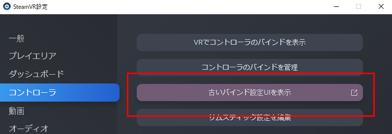
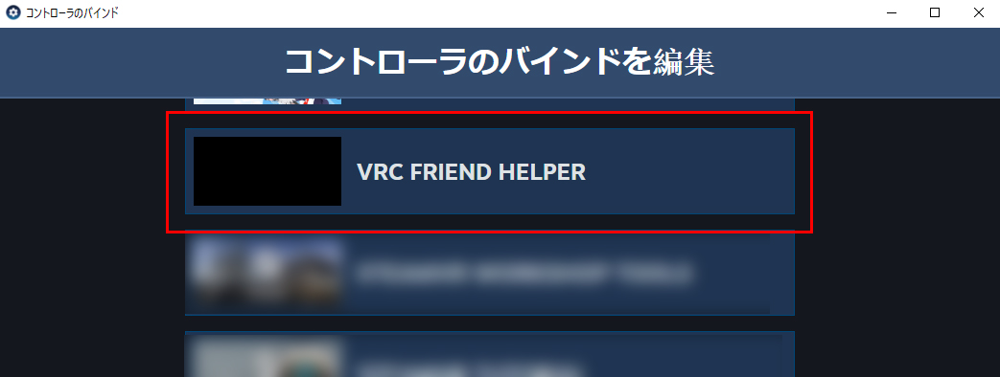
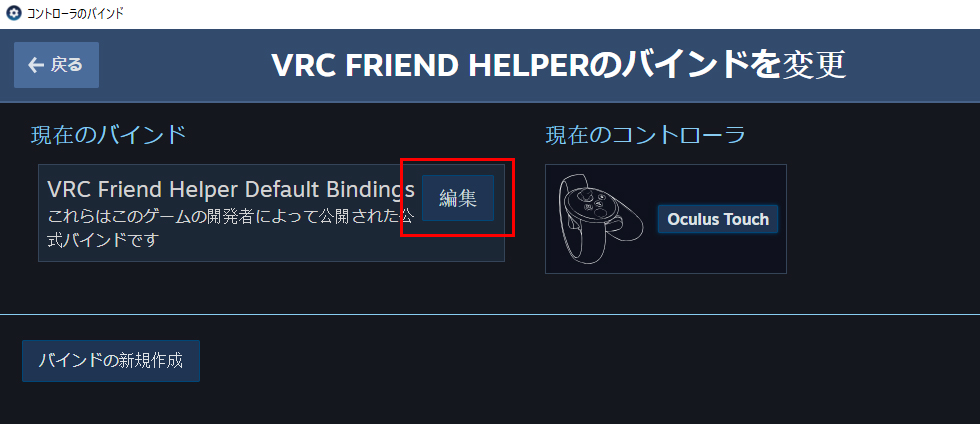
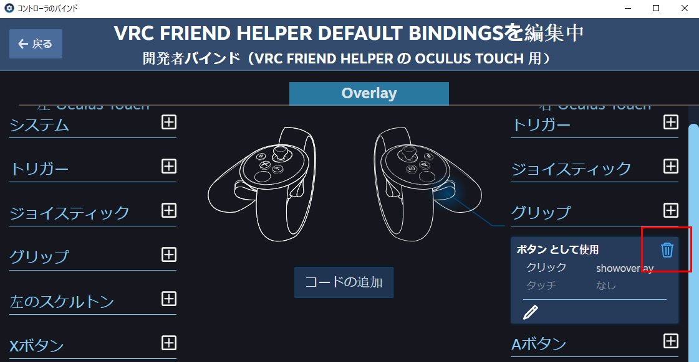

# VRChat Friend Helper

「このフレンド、何の人だっけ…？」を防げるツールです。

これを起動しながらVRChatに入ると、フレンドが同じインスタンスに居るとき、  
そのフレンドにあらかじめ付けたメモを  
デスクトップ、またはVR内で確認することができます。

使用例


## 前提

WindowsとSteamVRを使用しているものとします。

## 導入方法

[Releases](https://github.com/wararyo/VRChat-friend-helper/releases)より最新バージョンをダウンロードします。

### 必要なファイルの準備

ダウンロードしたzipファイルを展開し、お好みのフォルダに移動します。

`friends.csv`を開き、例にならってフレンドの表示名を一人一行で記述します。
UTF-8で保存してください。  
CSV形式ですが、`#`から始まる行はコメントとして扱われます。

初回の作成はブラウザでVRChatを開いて下記をURL欄に入力すると楽です。
(Chromeだと先頭の`javascript:`が自動的に消去されてしまうみたいなので、`javascript:`を手入力した後にペーストするとよいです)

```
javascript:let%20friendsHTML%20%3D%20%5B...document.querySelectorAll%28%22a.css-1u1s9ta%22%29%5D.map%28x%20%3D%3E%20x.innerText%29.join%28%22%2C%20%3Cbr%3E%22%29%3Bdocument.write%28friendsHTML%29
```


またはREPLで下記を実行します。  

``` javascript
let friendsHTML = [...document.querySelectorAll("a.css-1u1s9ta")].map(x => x.innerText).join(", <br>")
document.write(friendsHTML)
```

### SteamVRに登録

HMDを装着しSteamVRを起動した後に`VRC Friend Helper.exe`を起動します。  
自動的にVRC Friend HelperがスタートアップオーバーレイアプリとしてSteamVRに登録されます。  
これは、SteamVR設定の `スタートアップ／シャットダウン > スタートアップオーバーレイアプリを選択` から確認できます。


## 使い方

### VR
VRでは、SteamVRと同時にVRC Friend Helperが起動します。

右のOculus Touchコントローラーのグリップボタンを押しながら左右のコントローラーを近づけると、目の前にフレンド一覧が表示されます。  
(Oculus Touchコントローラー以外を用いている方は後述の[カスタマイズ](#カスタマイズ)からボタンを設定してください)

### デスクトップ
デスクトップのみで使うには、`VRC Friend Helper Desktop Mode.bat`を起動した後にVRChatを起動してください。

## カスタマイズ

VRにおいて、フレンド一覧を表示するためのボタンを変更できます。

SteamVR設定の古いバインド設定UIを表示します。



`VRC Friend Helper` を選択します。



バインドを編集します。



デフォルトで設定されている右グリップのバインドを削除します。



お好みのボタンに `showoverlay` を割り当てます。
下記は右スティック押し込みで交互に表示/非表示が切り替わるようにした設定例です。


## アンインストール

SteamVRを起動した状態で、`Uninstall.bat`を実行します。
スタートアップオーバーレイアプリにVRC Friend Helperが表示されていなければ成功です。
